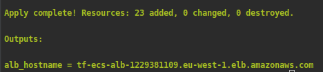
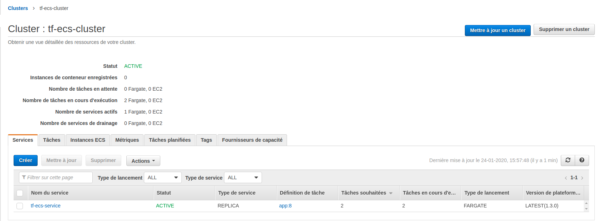
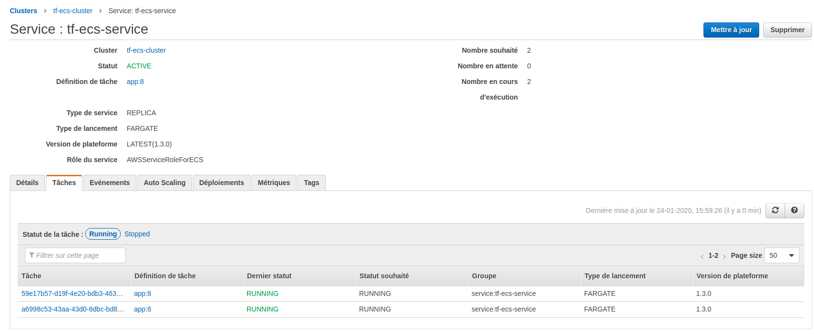
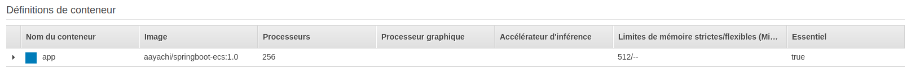
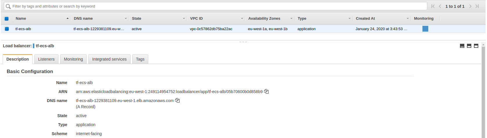
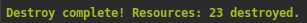

# Description
This is a simple example of docker spring boot application under **AWS ECS**, using **terraform** as infrastructure as code tool.

## Requirements
- [Install Terraform](https://www.terraform.io/downloads.html) (i'm using the  v0.12.16)
- [Configure your AWS CLI](https://serverless.com/framework/docs/providers/aws/guide/credentials/) (i'm using the aws-cli/1.16.259)

## Usage
Build the spring boot project.

``` bash
$ cd springboot-app
$ mvn package
```

Build and push the docker image to your dockerhub account (change **aayachi** with your account).

``` bash
$ docker build -t spring-app-ecs .
$ docker tag spring-app-ecs aayachi/springboot-ecs:1.0
$ docker login
$ docker push aayachi/springboot-ecs:1.0
```

Test your docker image locally (you should have "It's working" message)
``` bash
$ docker run -d -p 8080:8080 --rm  spring-app-ecs
$ curl http://localhost:8080
```

## Deploy the Infrastructure and Deploy on AWS ECS using Terraform
In the *variables.tf* file, change the *app_image* default value to your docker image.
Initialize your terraform working directory, this will create the .terraform directory that contain the aws 
provider
``` bash
$ cd ..
$ terraform init
```
Apply the terraform changes, **this will create the infrastructure and deploy the docker container on ECS**
``` bash
$ terraform apply
```
At the end of the terraform apply command you should have the **alb_hostname** output, this is the Application load balancer DNS.
you will use this DNS to access to your deployed service (you should have "It's working" message)

``` bash
$ curl **alb_hostname**
```

## Checking on AWS console
- On the Clusters under ECS you can find you new ECS Cluster


- On the ECS cluster, click on the service, there are two tasks runing


- On the Task Definition, select your taskdefinition and go to the containerDefintion bloc


- On the Load Balancers, select your load balancer to find some informations like the DNS name

## Destory the infrastructure
To destroy all resources created by terraform, execute this command
``` bash
$ terraform destroy
```



